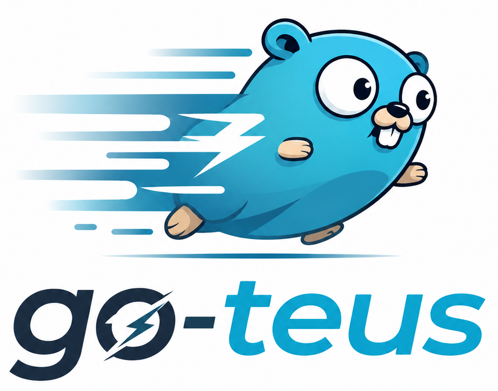

<p align="center">
  
</p>

go-teus (pronounced **"go t's"** => <small>[voice](assets/teus.mp3)</small>) is a lightweight **Go foundation module** that provides shared tools and utilities for backend development.

It is designed as a reusable **config and infrastructure toolkit** used across multiple projects such as ERP, MES, and microservices.

---

## Purpose

go-teus provides commonly used building blocks for backend systems:

- Configuration loader
- Database helper (SQLX ready)
- Logger utilities
- HTTP response helpers
- Error definitions
- General utilities

Instead of rewriting these components in every project, go-teus centralizes them into a single reusable module.

---

## Philosophy

go-teus is NOT a framework and does NOT contain business logic.

It is a **foundation toolkit** that sits below all applications.

> "Build once, reuse everywhere."

---

## Packages

- `config` → environment & configuration loader  
- `database` → PostgreSQL / SQLX helper  
- `http` → HTTP response helpers  
- `auth` → auth module 
- `middleware` → middleware definitions  
- `shutdown` → shutdown (graceful) function  
- `validator` → google (validator) binding struct  
- `wire` → base wire module (Chi Router)

---

## Installation

```bash
go get github.com/eonebyte/go-teus@v0.1.0
